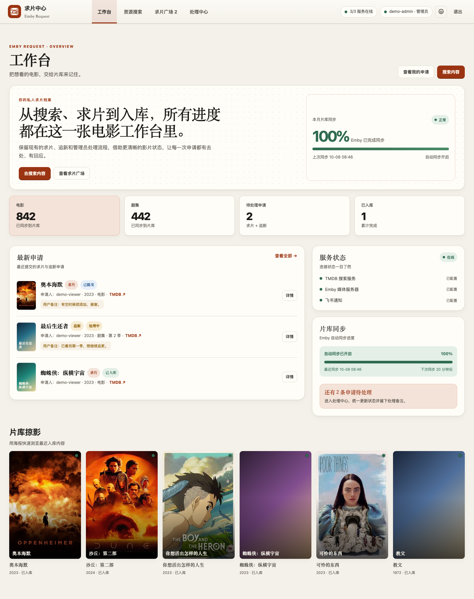
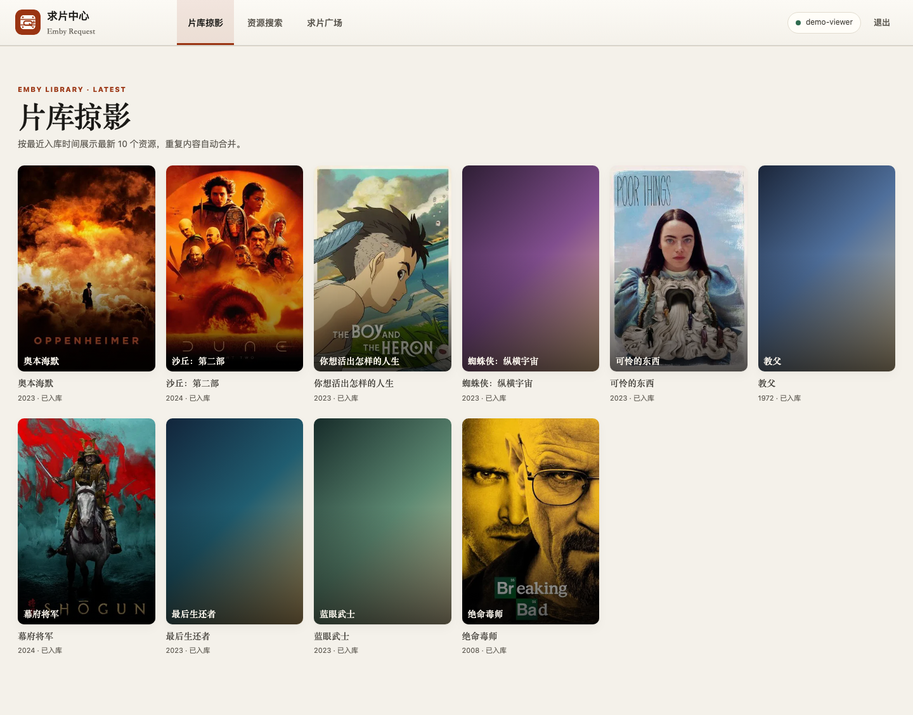
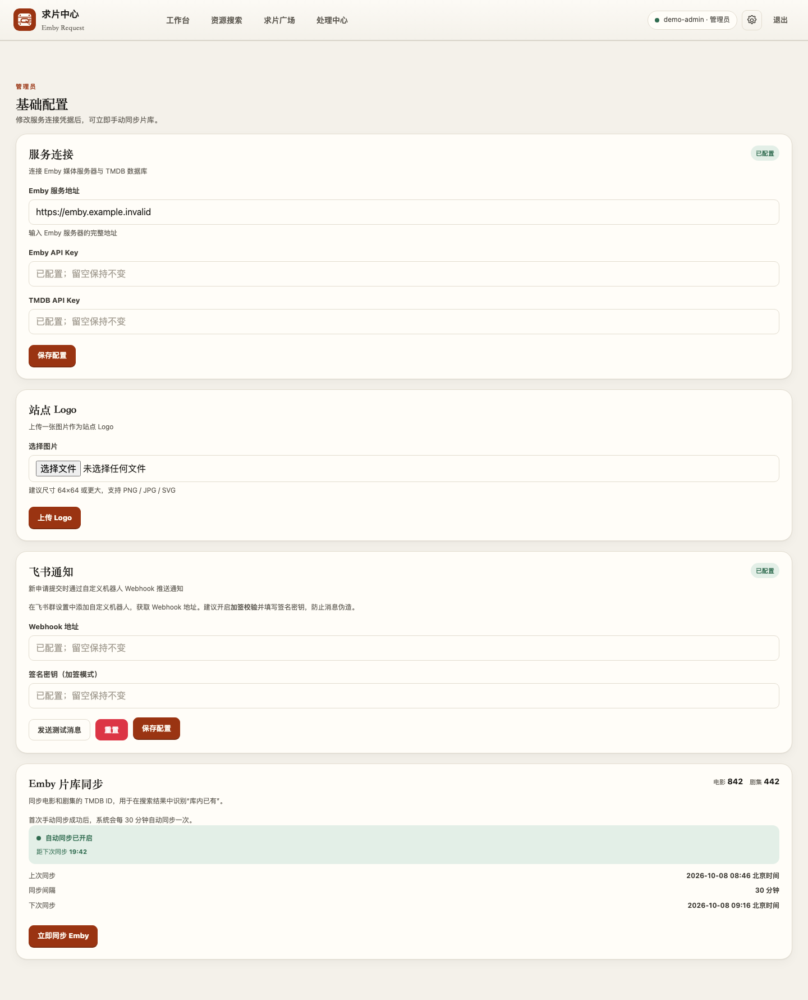
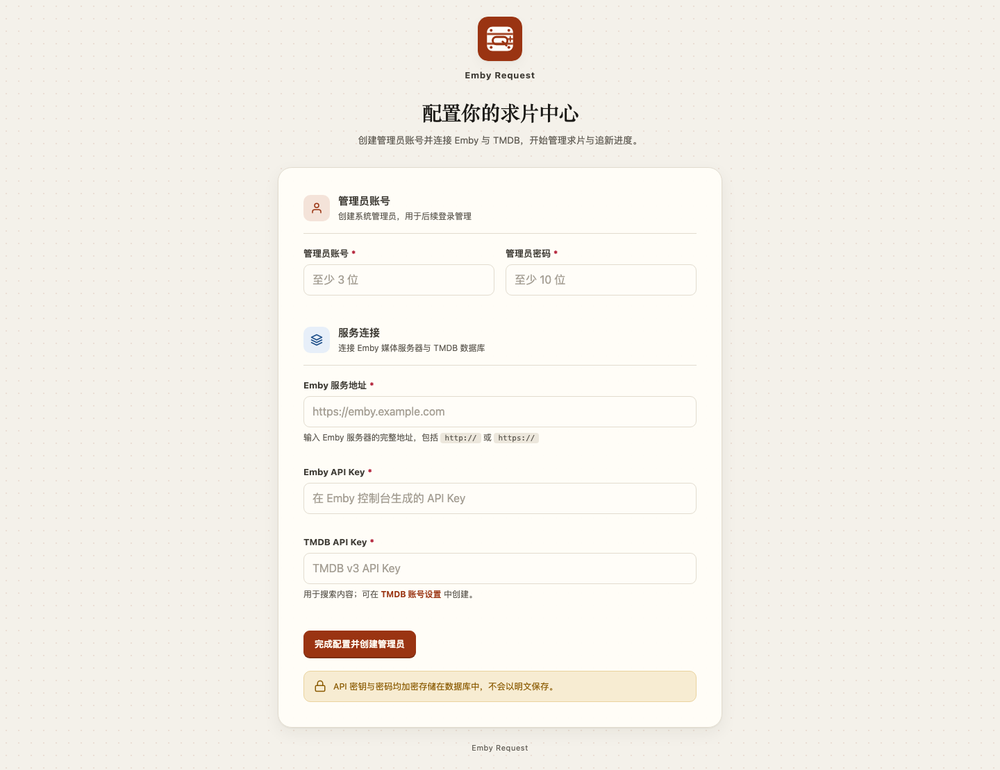

# Emby 求片中心

面向个人媒体库和小型 Emby 社群的媒体请求管理系统。用户可以搜索电影和剧集、提交求片或追新申请、查看申请进度；管理员可以同步 Emby 片库、管理用户和处理申请，并通过飞书接收新申请通知。

## v11 界面展示

以下图片由已测试通过的 v11 应用页面直接生成，展示了当前模板和布局。图片中的账号、片目数据、服务状态、统计数字和配置值均为演示内容；未使用真实用户数据、API Key、Webhook 或私有服务地址。

### 管理员工作台



### 普通用户片库掠影



### 资源搜索


### 移动端


### 管理员配置



### 初始化页面



> 公开发布截图使用演示账号和示例数据。海报由 TMDB 图片服务提供；因演示条目未配置海报的卡片会显示应用自己的占位样式。

## 功能

- 初始化向导：创建管理员账号并配置 Emby、TMDB。
- TMDB 中文搜索电影和剧集，显示海报、简介、年份和原始标题。
- 同步 Emby 电影、剧集及剧集季信息，并在搜索结果标识片库状态。
- 电影支持求片；剧集求片和追新均通过弹窗选择季数。
- 普通用户页面顺序为“片库掠影 / 资源搜索 / 求片广场”，不显示管理员工作台。
- 普通用户片库掠影按最新入库时间展示最多 10 个资源，并按 TMDB ID 与媒体类型去重。
- 管理员工作台展示申请概览、片库同步状态、服务状态、最新申请和 6 个片库掠影资源。
- 管理员可筛选、分页处理申请并添加处理备注；状态包括“测试数据”，使用灰色标签显示。
- 管理员可创建、启用、停用和删除普通用户。
- 新申请通过飞书机器人通知；支持签名校验和测试消息。Telegram 通知已移除。
- 管理员可上传站点 Logo；Logo、数据库和密钥通过 Docker Compose 持久化。
- 首次手动同步成功后，每 30 分钟自动同步 Emby 片库。
- 页面适配桌面端和移动端。

## 技术栈

| 类别 | 技术 |
| --- | --- |
| 后端 | Python 3.13、FastAPI、Uvicorn |
| 页面 | Jinja2、原生 CSS、响应式布局 |
| 数据库 | SQLite、SQLAlchemy 2 |
| 安全 | Starlette Session、CSRF Token、Argon2、Fernet 配置加密 |
| 外部服务 | TMDB v3 API、Emby Server API、飞书机器人 Webhook |
| 部署 | Docker、Docker Compose |

## Docker 部署

### 准备

- Docker Engine 或 Docker Desktop
- Docker Compose v2
- Emby 服务地址和 API Key
- TMDB v3 API Key
- 可选：飞书自定义机器人 Webhook 和签名密钥

### 启动

在项目根目录运行：

```sh
docker compose up -d --build
```

或者运行一键脚本：

```sh
./start.sh
```

应用默认监听 `9521` 端口。群晖上可在 Container Manager 的项目目录中使用此 `compose.yaml`，再访问：

```text
http://<NAS 地址>:9521
```

Compose 挂载使用相对路径，项目可以放在任意 NAS 目录中，无须修改本机绝对路径。

### 初始化

1. 首次访问时，创建管理员账号并填写 Emby 地址、Emby API Key 和 TMDB API Key。
2. 管理员登录后，在“站点配置”中手动同步一次 Emby 片库。
3. 在“用户管理”中创建普通用户。
4. 如需通知，在“站点配置 → 飞书通知”中填写 Webhook；开启加签时再填写签名密钥。

Emby、TMDB 和飞书凭据不会写进 Compose 文件。容器首次启动会生成会话密钥和配置加密密钥，服务凭据加密后保存到数据库。

## 数据持久化与备份

Compose 会在项目目录创建 `config/`：

```text
config/
├── emby_requests.db
├── secrets/
└── uploads/
```

升级、迁移或重装前，请备份完整的 `config/` 目录。数据库保存账号、申请、媒体索引和加密后的配置；`secrets/` 保存用于会话和解密配置的密钥；`uploads/` 保存站点 Logo。

如果丢失 `config/secrets/`，数据库中已加密的 Emby、TMDB 和飞书凭据将无法解密，需要重新配置。不要把 `config/` 上传到 GitHub。

## 常用命令

```sh
# 查看状态
docker compose ps

# 查看日志
docker compose logs -f app

# 停止应用，保留 config 数据
docker compose down

# 用当前源码重新构建
docker compose up -d --build
```

## HTTPS 与反向代理

如通过 Nginx、Caddy 或 Traefik 提供 HTTPS，请在确认代理已配置后，将 `compose.yaml` 中 `COOKIE_SECURE` 设为 `"true"`，再重建容器。纯 HTTP 访问时保持 `"false"`，否则浏览器不会发送登录 Cookie。

## GitHub 发布与脱敏

本发布包排除了数据库、备份、`.env`、密钥目录、上传 Logo、Python 缓存和本地临时文件。Compose 使用相对挂载路径。截图仅含演示账号、示例片目和占位服务地址。

上传仓库前请查看 [GitHub 上传检查清单](GITHUB_UPLOAD_CHECKLIST.md)，并确认没有把本地数据库或 `config/` 加入 Git。版本记录见 [CHANGELOG.md](CHANGELOG.md)。

## 许可与数据来源

项目代码未在此发布包中指定开源许可证。使用者应自行确认其部署、媒体数据和服务配置符合相应服务条款及内容授权要求。媒体元数据与海报由 TMDB 提供；Emby 服务器由部署者自行配置。
